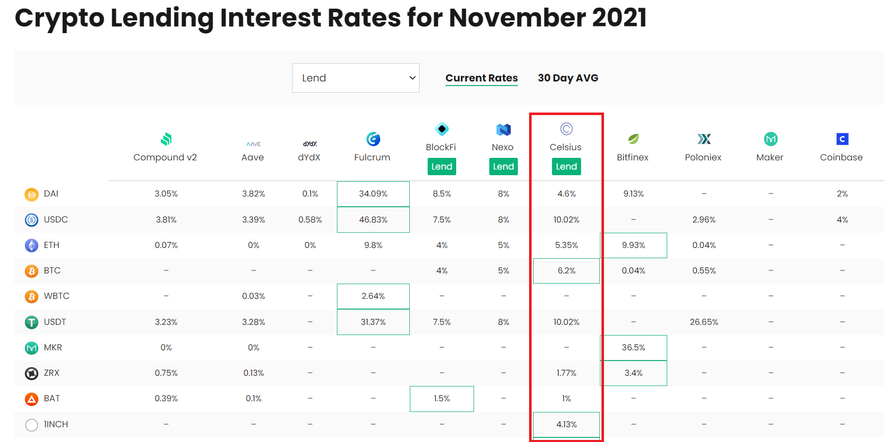

# Celsius Network

<!--
#### Company Information and Business Activities  (25 points)

##### To receive all points, you must:

* Select a company in the FinTech domain to research. (5 points)
* Provide a detailed description of the company's domain, audience, solution and business metrics. (10 points)
* Present company information in a clear and well-organized manner. (10 points)
-->

## Overview and Origin

The plan for Celsius Network was drawn up on a coffee shop napkin in 2017 by its founders, Alex Mashinsky and Daniel Leon.
[^1]
Celsius CEO, Alex Mashinsky has founded eight startups and several multi-billion-dollar businesses including Arbinet, Transit Wireless and GroundLink.
[^2]
Daniel Leon is the President and COO of Celsius and has co-founded and led multiple companies and not-for-profit organizations, including Beyon3D, Atlis Labs, and Governing Dynamics.
[^3]
The idea for Celsius came about after considering that traditional banks only reward their customers with interest rates as low as 1% or less but knowing they could potentially offer more.
Celsius' mission statement is: "To put unparalleled economic freedom in the hands of the people."
[^4]
Celsius held their initial coin offering (ICO) of their CEL token back in 2018 and raised $50 million.
[^5]

## Business Activities

Most banks typically make between 14-25% return on their capital, so by paying customers 1% in interest, they’re keeping over 80% of the profits and distributing these earnings to their shareholders, usually in the form of dividends and share buyback.
[^6]
The Celsius business model is structured to do the exact opposite of what banks do - by giving 80% of total revenue back to their community each week in the form of earned interest.
This effectively gives users similar privileges to shareholders.

Celsius Network serves as a wallet platform to deposit crypto assets, earn interest, and borrow 1% cash loans.
[^7]
By depositing crypto assets with Celsius, users can earn up to 17% yield on said assets, paid weekly.

Celsius' main sources of income include:
- Institutional lending
[^8]
- Providing liquidity to exchanges
[^2]
- Retail lending
[^8]
- DeFi staking
[^9]
- Mining BTC
[^10]

According to PointPay, the market for crypto loans, where bitcoin and stablecoins are pledged as collateral, is estimated at approximately $ 30-35 billion in 2021.
[^11]
With over 1 million users and over $27.5 billion assets under management, Celsius' intended customers include both individual retail investors and institutional investors.
[^7]

Celsius offers competitively high interest rate to users, allowing over 10% interest on stable coins like USDC and USDT.
Other companies like BlockFi and Nexo only offer less than 9% on stable coins.
Other interest rates can be seen below:

[^12]

To ensure the security of its assets under management, Celsius Network uses Multi-Party Computation (MPC) through its custodian, Fireblocks, which also allows them to have insurance for funds stored in Hot wallets.
[^13]

<!--
#### FinTech Domain Trends (20 points)

##### To receive all points, your code must:

* Communicate a thorough synopsis of trends and landmarks in the chosen FinTech domain. (10 points)
* Identify several major competitors. (10 points)
-->

## Landscape

According to The World Bank in 2019, loans to the private sector by banks around the world accounted for 90% of global GDP, and interest rates on deposits in the world have not increased for almost 10 years.
[^11]

The global crypto market cap recently reached $3 trillion, growing fivefold since November 2020, when it stood at $578 billion.
[^14]
Given that the first cryptocurrency, Bitcoin, was created just 12 years ago and traded at less than a cent at the time, the crypto market has exploded in the last decade.
The Cambridge Center for Alternative Finance in 2020 established that there are at least 100 million cryptocurrency users in the world.
[^11]
As cryptocurrencies gain adoption, more people will look towards earning interest on their crypto assets.
This has given rise to digital asset lending platforms (DALPs).
Some of these DALPs include Celsius' major competitors, such as:
- [Nexo](https://nexo.io/?v=t3)
- [Crypto.com](https://crypto.com/au/)
- [BlockFi](https://blockfi.com/)

## Results

Celsius aims to disrupt the traditional banking system and even has the slogan "Unbank yourself".
[^2]
Celsius users can make unlimited withdrawals and not pay any withdrawal, transfer, transaction, or early termination fees.
This includes withdrawal fees for ERC-20 tokens on the Ethereum blockchain, which has notoriously high gas fees.
A comparison of Celsius and some of its major competitors can be seen below:

| | **Celsius**[^7] | **Nexo**[^15] | **Crypto.com**[^16] | **BlockFi**[^17] |
| -------------------------- | -------------------------- | -------------------------- | -------------------------- | -------------------------- |
| Withdrawal Fees | Free[^7] | Free[^18] | Crypto.com charges a fee for all withdrawals that take place on-chain, but users can avoid these by using Crypto.com’s withdraw-to-app function.[^19] | One free crypto withdrawal per calendar month and one free stablecoin withdrawal per month. Each free withdrawal can only be applied to one currency each month. For each subsequent withdrawal request within that month, applicable withdrawal fees  will be applied.[^20] (stablecoins: $10 USD, Bitcoin: 0.00075 BTC)
| Interest rates (stablecoins, earn in kind) | 10.02%[^21] | 10%[^18] | 6% - 14% depending on loyalty tier and amount of CRO staked[^22] | With the exception of Tether at 9.5%, all stablecoins receive 9% interest on all deposits under 40,000, and 8% on any amount above[^23] |
| Interest rates (BTC) | 6.20% (<= 1 BTC) and 3.51% (> 1 BTC)[^21] | 6% APY[^18] | 1.5% - 8.5% depending on loyalty tier and amount of CRO staked[^22] | 4.5% (<= 0.1 BTC), 1% (0.1 - 0.35 BTC), and 0.1% (> 0.35 BTC)[^23]
| Insurance | Celsius does not have an insurance policy. Fireblocks, Celsius' custodian, provides insurance on digital assets held by Celsius.[^24] However, Celsius is also looking to implement an internal self-insurance feature. | Insurance with industry-renowned custodians - such as BitGo and LedgerVault - in the event of third-party hacks, theft, or loss of private keys[^25] | Use of LedgerVault for cold storage insurance against physical damage or destruction, and third-party theft [^26] | BlockFi uses partner company Gemini as its custodial service, and Gemini has its own insurance for its deposits.[^27] |
| Cryptocurrency trading | beta version available to selected users[^28] | Yes[^29] | Yes[^30] | Yes[^31] |
| Credit Card | Not yet available[^32] | Yes[^33] | Yes[^34] | Yes[^35] |
| Promo deal | Earn $50 in BTC with your first transfer of $400 or more on Celsius.[^36] | Earn $25 in BTC with your first transfer of $100 or more on Nexo[^37] | Earn $25 USD worth of CRO after successfully reserving a Metal Crypto.com Visa Card (cheapest is $500 AUD)[^38] | Earn $15 in BTC with your first transfer of $100 or more on BlockFi[^39] |

<!--
#### Recommendations (20 points)

##### To receive all points, your code must:

* Thoroughly explain company recommendations. (10 points)
* Base company recommendations in solid research. (10 points)
-->

## Recommendations

One service I would recommend to Celsius would be the Interest Flex Payment feature that BlockFi offers.
[^]<!-- https://help.blockfi.com/hc/en-us/articles/360048863152-What-is-the-Interest-Flex-Payment-option- -->
This service allows users to choose the currency their interest is paid in.
As an example, if you hold BTC and USDC, but want to begin accumulating ETH, you can elect to have all interest paid in ETH.
This allows users to easily diversify their assets without having to buy additional crypto.
With higher interest rates than BlockFi, this may entice a portion of BlockFi users to start using Celsius if they are not already using it.

Converting the earned interest into a single currency may require swapping a user's tokens on decentralised exchanged (DEX) and/or centralised exchanges (CEX).
The OpenOcean protocol may be the most appropriate for this task.

OpenOcean is the world's first full aggregation protocol for crypto trading that sources liquidity from DeFi and CeFi markets and enables cross-chain swaps.
[^]<!-- https://openocean.finance/ -->
OpenOcean's routing algorithm finds the best prices from DEXes and CEXes and splits the routes to provide traders the best prices with low slippage and fast settlement.
The product is free to use; OpenOcean users only need to pay the regular blockchain gas and exchange fees for the trades, which are charged by the exchanges and not OpenOcean.

<!--
### Requirements

#### Research Depth (15 points)

##### To receive all points, your code must:

* Use multiple sources to present a thorough and cohesive view of the company's domain, history and results. (5 points)
* Specifically quote sources and reference them clearly and accurately. (10 points)

#### Report Presentation (20 points)

##### To receive all points, your report must include:

* Present the report in a ReadME.md file in a Github repository. (10 points)
* The report style showcases the writer's expertise and builds credibility. (10 points)
-->
## Conclusion

Celsius is a great way to earn interest on your cryptocurrencies.
Although some of its competitors have already launched credit cards and cryptocurrency trading on their platforms, Celsius is not far behind and is also in the process of implementing such products and services.
With some of the highest interest rates amongst its competitors, Celsius remains a popular crypto lending and borrowing platform.

## References

[^1]: [About Us | Celsius](https://celsius.network/about-us)
[^2]: [Celsius Whitepaper](https://celsius.network/static/media/celsius-whitepaper.5f1941f3.pdf)
[^3]: [S. Daniel Leon | LinkedIn](https://www.linkedin.com/in/sdanielleon/)
[^4]: [The Mission and Values of Celsius Network](https://blog.celsius.network/the-mission-and-values-of-celsius-network-b5715732dc7)
[^5]: [How Celsius Turned Its Crypto ICO Into a Billion-Dollar Lending Business](https://www.coindesk.com/markets/2019/09/07/how-celsius-turned-its-crypto-ico-into-a-billion-dollar-lending-business/)
[^6]: [Celsius Network Interest Rates, Explained](https://blog.celsius.network/celsius-network-interest-rates-explained-a336a52e163d)
[^7]: [Celsius | Unbank Yourself](https://celsius.network/)
[^8]: [What We Do & How We Do It. The Celsius business model, explained](https://blog.celsius.network/what-we-do-how-we-do-it-9a82124f7159)
[^9]: [Alex Mashinsky, Celsius CEO, interview:  Is Crypto Lending & Borrowing a good idea? Find out!](https://youtu.be/XUu3WcfssmE?t=579)
[^10]: [Celsius invests over $200m in Bitcoin mining in North America (prnewswire.com)](https://www.prnewswire.com/news-releases/celsius-invests-over-200m-in-bitcoin-mining-in-north-america-301306009.html)
[^11]: [The Market of Crypto Loans Is Rapidly Growing](https://www.einnews.com/pr_news/538251053/the-market-of-crypto-loans-is-rapidly-growing)
[^12]: [Comparison of Crypto Lending Rates as at 2021-11-13](https://defirate.com/lend/)
[^13]: [How Celsius Network keeps your funds safe and why it is 10X better than any other company in Crypto](https://celsiushub.com/article/how-celsius-network-keeps-your-funds-safe-and-why-it-is-10x-better-than-any-other-company-in-crypto-1613407918502x661580604726575100)
[^14]: [Cryptocurrencies hit market cap of $3 trillion for the first time as Bitcoin and Ether reach record highs](https://fortune.com/2021/11/09/cryptocurrency-market-cap-3-trillion-bitcion-ether-shiba-inu/)
[^15]: [Celsius vs Nexo | CoinCentral](https://coincentral.com/celsius-vs-nexo-comparing-two-top-crypto-interest-accounts/)
[^16]: [Celsius vs Crypto.com | CoinCentral](https://coincentral.com/celsius-vs-crypto-com/)
[^17]: [BlockFi Review | CoinCentral](https://coincentral.com/blockfi-review/)
[^18]: [Earn Crypto Interest | Nexo](https://nexo.io/earn-crypto)
[^19]: [What Fees May Occur on the Crypto.com Exchange?](https://help.crypto.com/en/articles/3511276-what-fees-may-occur-on-the-crypto-com-exchange)
[^20]: [BlockFi Fees Schedule](https://blockfi.com/fees/)
[^21]: [Earn Rewards on Your Crypto | Celsius](https://celsius.network/earn-rewards-on-your-crypto)
[^22]: [Crypto Earn | Crypto.com](https://crypto.com/au/earn)
[^23]: [Crypto Interest Rates | BlockFi](https://blockfi.com/rates)
[^24]: [Does Celsius have an insurance policy?](https://support.celsius.network/hc/en-us/articles/360002174718-Does-Celsius-have-an-insurance-policy-)
[^25]: [Security and Insurance | Nexo](https://support.nexo.io/hc/en-us/articles/360017628093-Security-and-Insurance)
[^26]: [Security - Industry-Leading Security Infrastructure | Crypto.com](https://crypto.com/au/security)
[^27]: [What are the risks of holding my crypto at BlockFi? | BlockFi](https://help.blockfi.com/hc/en-us/articles/360048862572-What-are-the-risks-of-holding-my-crypto-at-BlockFi-)
[^28]: [Swap Crypto | Celsius](https://celsius.network/swap-crypto)
[^29]: [Nexo Exchange](https://nexo.io/exchange)
[^30]: [Crypto.com Exchange](https://crypto.com/exchange)
[^31]: [BlockFi Trading](https://blockfi.com/trading)
[^32]: [Credit Card Waitlist](https://celsius.network/credit-card-waitlist)
[^33]: [Nexo Card](https://nexo.io/nexo-card)
[^34]: [Crypto.com Visa Card](https://crypto.com/au/cards)
[^35]: [Bitcoin Credit Card | Visa Crypto Rewards Card | Earn 1.5%](https://blockfi.com/credit-card/)
[^36]: [Celsius Promo code $50 of BTC with first transfer of $400 USD or more](https://celsiusnetwork.app.link/19334565c2)
[^37]: [Nexo Referral Promo code](https://nexo.io/referral)
[^38]: [Both Get $25 CRO Referral Program](https://help.crypto.com/en/articles/3124990-bg25-referral-program)
[^39]: [BlockFi Promotions](https://blockfi.com/promotions/)
